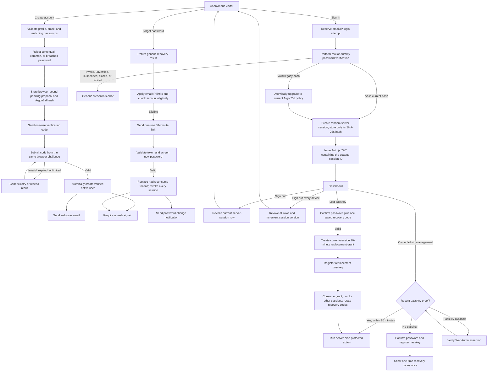
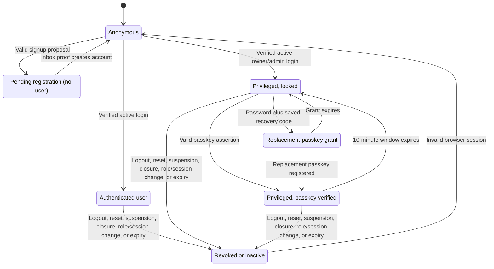

# Field Atlas authentication and privileged access

This document describes the authentication and authorization system that is
implemented in Field Atlas. It is the reference for signup, email verification,
credentials login, database-backed sessions, password recovery, roles, account
status, passkey step-up, and privileged account recovery.

## End-to-end flow



Signup does not create a user or an authenticated session. It stores the
normalized address, proposed profile, and proposed Argon2id hash in a
short-lived pending registration bound to an HTTP-only browser challenge.
Successful inbox proof creates the real account inside the same transaction that
consumes the code. This prevents an attacker from pre-registering a victim's
address with an attacker-controlled password.

If a pre-migration unverified row exists, verification replaces its untrusted
profile and credential and revokes its sessions. A verified row is never
overwritten. Repeating signup rotates the entire pending proposal, so an older
code cannot activate newer or attacker-selected credentials.

## Effective authentication states



Every session evaluation joins the JWT to current database state. Access is
valid only when all of these are true:

1. The JWT contains a valid random session ID and immutable authentication time.
2. The SHA-256 hash of that ID resolves to a non-revoked server session.
3. The server session has not passed its absolute expiration.
4. Its authentication time and user session version match the JWT.
5. The user still exists, has verified email, and has account status active.
6. The current database role is used for authorization.

The JWT's raw opaque session ID is never stored in PostgreSQL. The
sessionReference exposed to server code is its SHA-256 hash.

| State                | Durable account             | Server session                                   | Effective access                       |
| -------------------- | --------------------------- | ------------------------------------------------ | -------------------------------------- |
| Anonymous            | None or irrelevant          | None                                             | Public pages                           |
| Pending registration | No user for new signup      | None                                             | Verification form only                 |
| Authenticated user   | Verified and active         | Current and unexpired                            | Owned dashboard data and actions       |
| Privileged, locked   | Verified active admin/owner | Current; no recent passkey proof                 | Ordinary dashboard plus security setup |
| Privileged, verified | Verified active admin/owner | Current; passkey proof no older than 10 minutes  | Protected management actions           |
| Replacement grant    | Verified active admin/owner | Current; no MFA elevation                        | Replacement-passkey enrollment only    |
| Revoked/inactive     | Any                         | Missing, revoked, expired, or version-mismatched | No protected access                    |

## Routes and server boundaries

| Route                                             | Anonymous           | Verified active session         |
| ------------------------------------------------- | ------------------- | ------------------------------- |
| /                                                 | Allowed             | Allowed with account navigation |
| /sign-up, /login, /verify-email, /forgot-password | Allowed             | Redirected to /dashboard        |
| /reset-password?token=...                         | Allowed             | Allowed                         |
| /dashboard/**                                     | Redirected to login | Allowed                         |
| /dashboard/security                               | Redirected to login | Session and credential controls |
| /dashboard/owner/**                               | Redirected to login | Admin/owner navigation boundary |

The route proxy is only the first boundary. Protected pages, route handlers,
server actions, and data mutations must call requireVerifiedSession at the
point of use. Role-sensitive code calls requireRole or
requirePrivilegedStepUp, and every private record query still verifies resource
ownership.

Protected management actions require a recent passkey assertion inside the
server action itself. Navigating to a management page is not authorization to
mutate. Recovery codes never satisfy this check.

## Roles and account status

Field Atlas has three hierarchical application roles:

| Role  | Access                                                                  |
| ----- | ----------------------------------------------------------------------- |
| user  | The verified user's own atlas, memories, chapters, and account controls |
| admin | User access plus limited management of ordinary users                   |
| owner | Administrator appointment/removal and the complete management surface   |

Public signup always creates role user. Admins cannot manage peer admins,
appoint administrators, or alter the owner. Only the owner can promote or
demote admins. The database enforces that the sole owner remains verified and
active; application policy prevents editing, demoting, suspending, revoking, or
deleting that account.

Account status is independent from verification and role:

| Status    | Login and session behavior                                            |
| --------- | --------------------------------------------------------------------- |
| active    | May authenticate when email is verified                               |
| suspended | Login denied; existing sessions and privileged recovery state revoked |
| closed    | Login denied; treated as inactive                                     |

Role changes and management revocation revoke server sessions and increment
session_version. Demotion from admin also invalidates privileged recovery codes
and grants.

## Password and credential controls

| Control             | Implemented behavior                                                              |
| ------------------- | --------------------------------------------------------------------------------- |
| Password storage    | Argon2id; 19 MiB memory, 2 iterations, parallelism 1                              |
| Hash migration      | bcrypt and older Argon2id parameters rehash after successful login                |
| Password policy     | 15–128 Unicode characters; common, contextual, and breached values rejected       |
| Breach screening    | HIBP k-anonymous range lookup; only five SHA-1 prefix characters leave the server |
| Unknown-user timing | Dummy Argon2 verification keeps the credential path comparable                    |
| Login limits        | 10 failures/email, 30 failures/IP, 20 total/email, and 60 total/IP per 15 minutes |
| Signup limits       | 5 requests/email and 20 requests/IP per hour                                      |
| Remember me         | Optional local-storage email only; never stores password or session material      |
| Generic outcomes    | Signup, login, verification, resend, and reset avoid account-existence disclosure |

The HIBP check is availability-safe: provider failure is audited and local
policy still applies. No plaintext password or full digest is sent to it.

## Email verification and password reset

| Control               | Implemented behavior                                                        |
| --------------------- | --------------------------------------------------------------------------- |
| Verification code     | Cryptographically random six digits, 10-minute lifetime, one use            |
| Verification binding  | Pending profile/hash plus HTTP-only challenge cookie; same browser required |
| Verification storage  | HMAC-SHA-256 under AUTH_HMAC_SECRET; plaintext code is not stored           |
| Verification requests | 3/email/hour, 20/IP/hour, 60-second resend cooldown                         |
| Verification attempts | 5/email and 20/IP per 15 minutes                                            |
| Reset token           | 32 random bytes encoded base64url; 30-minute lifetime; one use              |
| Reset storage         | SHA-256 hash only                                                           |
| Reset requests        | 3/email and 20/IP per hour                                                  |
| Reset attempts        | 5/token and 20/IP per 15 minutes                                            |
| Reset concurrency     | User-scoped advisory lock serializes issuance and consumption               |
| Reset result          | New Argon2id hash, all reset tokens consumed, all sessions revoked          |
| Email delivery        | Resend with 5-second timeout, bounded retry, and idempotency key            |

An eligible reset requires a verified active account. Request responses remain
generic. Reset and signup apply the same contextual/breached-password policy.

## Session lifecycle

Auth.js maintains a signed JWT with a 12-hour inactivity window. That JWT is not
sufficient by itself. Each login creates an independently revocable PostgreSQL
session row:

| Role at login | Absolute server-session lifetime |
| ------------- | -------------------------------- |
| user          | 7 days                           |
| admin         | 24 hours                         |
| owner         | 24 hours                         |

The earlier of JWT inactivity expiry, server absolute expiry, explicit
revocation, account/role/version change, or user deletion ends access. Ordinary
logout revokes the current server session before clearing the browser cookie.
Sign out everywhere and password reset revoke every session. Session creation
is serialized per user and keeps at most 10 active server sessions; an eleventh
login atomically retires the oldest active row. For privileged accounts,
sessions that have completed passkey step-up are retained before password-only
sessions. If all 10 slots are passkey-protected, another password login is
rejected without changing the protected session set.

## Passkey step-up and recovery

Passkeys protect privileged management; they are not currently a passwordless
login method and they are not universal MFA for ordinary users.

- Registration and assertions use WebAuthn with exact RP ID/origin validation
  and required user verification.
- Challenges are random, single-use, short-lived, server stored, and bound to
  the current user, server session, and ceremony purpose.
- Credential IDs are unique; public keys, counters, backup state, transports,
  labels, and use time are stored server-side.
- A privileged account may hold at most 10 credentials.
- Adding another privileged credential requires an existing recent passkey
  assertion plus the current password.
- Removing a privileged credential requires recent passkey proof, and the final
  privileged credential cannot be removed.
- Successful assertion unlocks protected actions for 10 minutes in only the
  current server session.

Recovery codes are an offline emergency path:

- Ten codes are generated from 120 random bits each and shown only once.
- PostgreSQL stores only user-bound HMAC-SHA-256 digests.
- Each code is single-use; replacing the set invalidates every prior code.
- Redemption requires the current password and is rate limited by user,
  session, and IP.
- Redemption creates only a current-session, 10-minute grant to register a
  replacement passkey. It does not set MFA and cannot authorize management.
- Completion atomically consumes the grant, marks the current session as
  passkey-verified, revokes other sessions, rotates codes, and writes a durable
  audit event.
- Code creation, code use, and completed recovery send out-of-band security
  notifications that never contain recovery secrets.

There is intentionally no password-only bypass after a privileged account has
enrolled a passkey.

## Stored authentication data

| Table                                                     | Purpose                                                                 |
| --------------------------------------------------------- | ----------------------------------------------------------------------- |
| users                                                     | Identity, password hash, email proof, role, status, and session version |
| pending_registrations                                     | Browser-bound proposed profile and password hash                        |
| pending_registration_attempts                             | Verification abuse accounting                                           |
| email_verification_requests                               | Verification/resend request limits                                      |
| login_attempts                                            | Hashed email/IP login accounting                                        |
| account_creation_requests                                 | Hashed email/IP signup accounting                                       |
| password_reset_tokens                                     | Active and consumed reset-token hashes                                  |
| password_reset_requests                                   | Hashed email/IP reset-request accounting                                |
| password_reset_attempts                                   | Token/IP reset-attempt accounting                                       |
| auth_sessions                                             | Hashed session IDs, absolute expiry, revocation, and passkey proof      |
| user_passkeys                                             | WebAuthn credential public material and metadata                        |
| webauthn_challenges                                       | Session-bound registration/step-up challenges                           |
| passkey_reauth_attempts                                   | Password confirmation abuse accounting                                  |
| privileged_recovery_code_sets / privileged_recovery_codes | Hashed offline recovery material                                        |
| privileged_passkey_recovery_grants                        | One-purpose replacement-passkey grants                                  |
| privileged_recovery_attempts                              | Recovery abuse accounting                                               |
| auth_security_events                                      | Durable redacted audit events                                           |
| security_notification_outbox                              | Transactional leased security-email delivery and retry state            |

Expired challenge, token, session, attempt, upload-intent, and audit data is
removed by the authenticated daily cleanup route. WebAuthn challenges and
passkey reauthentication attempts receive an explicit 24-hour retention grace
before deletion. Expiration is enforced in the authorization query itself;
cleanup is retention, not the security boundary.

## Secrets, database roles, and migrations

Required production configuration includes:

```dotenv
APP_URL=https://your-production-origin.example
AUTH_SECRET=<independent-authjs-secret-at-least-32-bytes>
AUTH_HMAC_SECRET=<independent-auth-pseudonym-secret-at-least-32-bytes>
MEDIA_GRANT_SECRET=<independent-private-media-signing-secret-at-least-32-bytes>
DATABASE_URL=<pooled-least-privilege-runtime-connection>
MIGRATION_DATABASE_URL=<direct-schema-owner-connection>
CRON_SECRET=<independent-maintenance-secret-at-least-32-bytes>
NEXT_SERVER_ACTIONS_ENCRYPTION_KEY=<stable-server-action-key>
PASSKEY_ORIGIN=https://your-production-origin.example
PASSKEY_RP_ID=your-production-origin.example
RESEND_API_KEY=<provider-key>
RESEND_FROM_EMAIL=Field Atlas <account@your-verified-domain.example>
RESEND_REPLY_TO_EMAIL=<monitored-security-contact>
```

AUTH_SECRET, AUTH_HMAC_SECRET, and MEDIA_GRANT_SECRET must be independent in
production. Rotating AUTH_SECRET signs users out. Rotating AUTH_HMAC_SECRET
invalidates pending codes, rate-limit pseudonyms, and recovery-code digests.
Rotating MEDIA_GRANT_SECRET invalidates outstanding private-image grants.

The deployed app receives the least-privilege runtime DATABASE_URL. Only
migration automation or an operator receives MIGRATION_DATABASE_URL. The
runtime role may perform required row CRUD and sequence use but cannot create or
truncate schema objects, create roles/databases, bypass row security, or access
the migration checksum ledger.

Apply every migration before deploying dependent application code:

```bash
npm run migrate:auth
```

Never edit an applied migration. The runner records filename and SHA-256
checksum and rejects drift. See the
[deployment security runbook](../operations/deployment-security.md).

## Automated assurance

The local suite covers validation, policy helpers, server-action authorization,
session behavior, concurrency SQL shape, UI recovery states, CSP, upload
authorization, and privacy DTOs. CI adds real PostgreSQL 16/PostGIS coverage:

- all migrations applied twice to prove idempotency;
- runtime-role provisioning and denied DDL/TRUNCATE;
- pending-registration pre-hijack and concurrent verification;
- verified/active credential login and hashed session creation;
- single/all-session revocation and absolute expiry;
- concurrent reset issuance and one-use consumption;
- the reset issuance-versus-redemption shared-lock race;
- recovery grants rejected as privileged step-up.

The integration job refuses non-loopback databases and requires the dedicated
field_atlas_ci database name.

## Release verification checklist

- Apply every unapplied migration to a backed-up preview database before code.
- Provision and verify the least-privilege runtime role.
- Create an account; verify that no users row/session exists before inbox proof.
- Repeat signup with a different password; verify only the newest proposal can
  activate and a verified existing account is never overwritten.
- Verify login rejects unknown, unverified, suspended, and closed accounts with
  the same generic outcome.
- Verify current logout, sign out everywhere, role/status changes, and password
  reset invalidate the expected sessions.
- Enroll two passkeys for a privileged test account and test step-up expiry,
  final-passkey removal protection, demotion, and suspension.
- Download recovery codes once; redeem one with the current password; verify
  management remains locked until replacement WebAuthn succeeds.
- Confirm recovery completion revokes every other session, rotates codes, and
  sends all three no-secret security notifications.
- Confirm WebAuthn RP ID and origin exactly match production and each preview
  hostname.
- Confirm verification, welcome, reset, password-change, account-status,
  passkey, and recovery messages appear with the verified sender/reply-to.
- Run npm run prettier:check, npm run lint, npm run typecheck,
  npm run test:ci, npm run test:integration:auth, npm audit, and npm run build.

## Code map

- [auth.ts](../../auth.ts) and
  [credentials.ts](../../app/lib/auth/credentials.ts) — credential login,
  signed JWT callbacks, and database-backed session validation.
- [actions.ts](../../app/lib/actions.ts) and
  [email-verification.ts](../../app/lib/auth/email-verification.ts) — pending
  signup, verification limits, and atomic activation.
- [session-record.ts](../../app/lib/auth/session-record.ts) and
  [session.ts](../../app/lib/auth/session.ts) — session persistence and
  authorization boundaries.
- [reset-password.ts](../../app/lib/auth/reset-password.ts) — reset issuance,
  shared locking, one-time consumption, and global revocation.
- [passkeys.ts](../../app/lib/auth/passkeys.ts) and
  [passkeys actions](../../app/lib/actions/passkeys.ts) — WebAuthn ceremonies
  and privileged step-up.
- [recovery-codes.ts](../../app/lib/auth/recovery-codes.ts) and
  [recovery actions](../../app/lib/actions/recovery-codes.ts) — offline codes
  and replacement-passkey grants.
- [recovery-email.ts](../../app/lib/auth/recovery-email.ts) — transactional and
  security notifications.
- [migrations](../../migrations) — schema, constraints, indexes, and guards.
- [CI workflow](../../.github/workflows/ci.yml) — independent quality and real
  PostgreSQL authorization gates.
