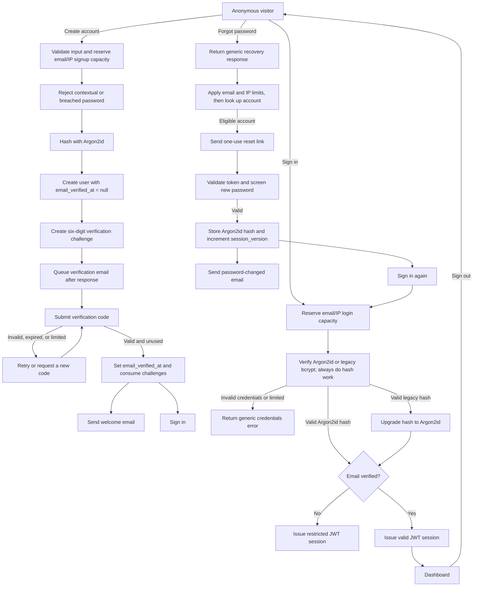
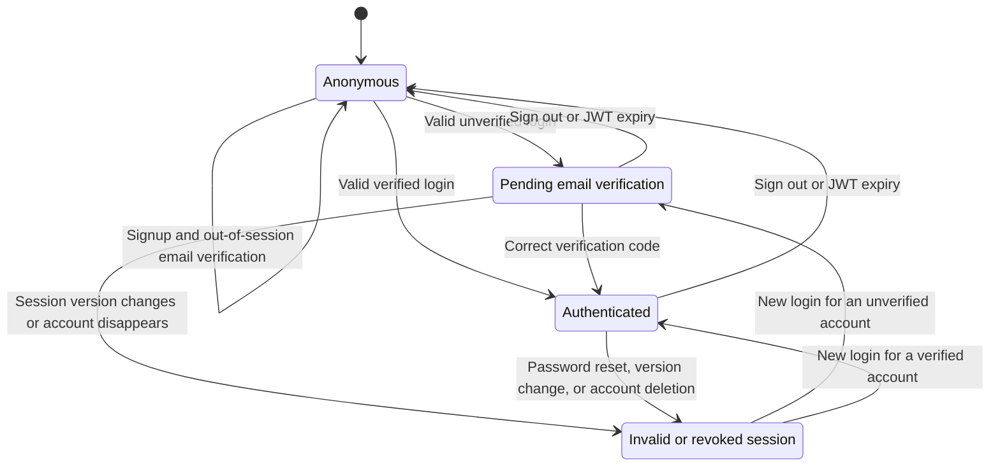

# Wooden Bridge authentication

This document describes the authentication system as implemented. It is the
reference for account creation, email verification, credentials login, session
authorization, password recovery, logout, and future feature gates.

## Flow overview



Signup deliberately does not create a session. Every syntactically valid signup
receives the same verification-page response whether the account is new,
already verified, rate limited, or otherwise ineligible. This prevents the
browser state and response text from becoming an account-enumeration oracle.

Email delivery is deliberately outside the authorization decision. A temporary
welcome or password-change notification failure does not undo a successful
verification or password update. A failed verification or reset email delivery,
however, invalidates the newly created challenge or token.

## Authentication states



The effective state is derived on every session evaluation by comparing the JWT
with current database state:

| State                | JWT user | `email_verified_at` | JWT version matches `session_version` | `sessionValid` | Effective access                   |
| -------------------- | -------- | ------------------- | ------------------------------------- | -------------- | ---------------------------------- |
| Anonymous            | No       | N/A                 | N/A                                   | `false`        | Public pages                       |
| Pending verification | Yes      | `null`              | Yes                                   | `false`        | `/verify-email` only               |
| Authenticated        | Yes      | Set                 | Yes                                   | `true`         | Public pages and `/dashboard/**`   |
| Invalid or revoked   | Yes      | Any                 | No, or user missing                   | `false`        | No protected routes; sign in again |

`email_verified_at` is the durable proof that the address was verified.
`session_version` is the revocation switch. `sessionValid` is the final access
decision and must be true before a feature treats a request as authenticated.

For future feature gating, keep account policy separate from identity proof. For
example, add an explicit `account_status` such as `active`, `suspended`, or
`closed`, then require all three conditions:

1. The session version is current.
2. The email is verified.
3. The account status permits the requested operation.

Do not infer suspension or product entitlement from `email_verified_at`.

## Route behavior

| Route                       | Anonymous | Pending verification          | Authenticated                   |
| --------------------------- | --------- | ----------------------------- | ------------------------------- |
| `/`                         | Allowed   | Redirected to `/verify-email` | Allowed with account navigation |
| `/sign-up`                  | Allowed   | Redirected to `/verify-email` | Redirected to `/dashboard`      |
| `/login`                    | Allowed   | Redirected to `/verify-email` | Redirected to `/dashboard`      |
| `/verify-email`             | Allowed   | Allowed                       | Redirected to `/dashboard`      |
| `/forgot-password`          | Allowed   | Redirected to `/verify-email` | Redirected to `/dashboard`      |
| `/reset-password?token=...` | Allowed   | Redirected to `/verify-email` | Allowed                         |
| `/dashboard/**`             | Denied    | Denied                        | Allowed                         |

The route proxy is a first boundary, not the only boundary. Protected pages,
server actions, route handlers, and data mutations should call
`requireVerifiedSession()` at the point of use before reading or changing
private data. This helper requires a user, verified email, and current session
version.

## Security controls

| Control                | Current behavior                                                                                   |
| ---------------------- | -------------------------------------------------------------------------------------------------- |
| Password storage       | Argon2id, 19 MiB memory, 2 passes, parallelism 1                                                   |
| Legacy password hashes | bcrypt is accepted on login and atomically upgraded after success                                  |
| Password policy        | 15–128 Unicode characters; common, contextual, and breached passwords blocked                      |
| Breach screening       | HIBP k-anonymous range API; only five SHA-1 prefix characters leave the server                     |
| Email handling         | Trimmed/lowercased with a database-enforced unique `LOWER(email)` identity                         |
| Session                | Auth.js signed JWT, 12-hour maximum age                                                            |
| Session authorization  | Cached server-only DAL requires verified, current session state                                    |
| Session revocation     | Password reset increments `users.session_version`; deleted users lose JWTs                         |
| Login resistance       | Generic response; dummy hash work for unknown accounts; 10/email and 30/IP failures per 15 minutes |
| Signup resistance      | Generic account result; 5/email and 20/IP requests per hour                                        |
| Verification code      | Cryptographically random six-digit code, 10-minute expiry, one use                                 |
| Verification storage   | HMAC-SHA-256 digest keyed by `AUTH_SECRET`; plaintext code is not stored                           |
| Verification cookie    | HTTP-only, `SameSite=Lax`, secure in production, 10-minute lifetime                                |
| Verification requests  | 3 per email per hour, 20 per IP per hour, 60-second resend cooldown                                |
| Verification attempts  | 5 failed attempts per user and 20 per IP per 15 minutes                                            |
| Reset token            | 32 random bytes encoded as base64url, 30-minute expiry, one use                                    |
| Reset storage          | SHA-256 token hash; plaintext token is not stored                                                  |
| Reset requests         | 3 per email and 20 per IP per hour                                                                 |
| Reset attempts         | 5 per token and 20 per IP per 15 minutes                                                           |
| Enumeration resistance | Signup, login, verification, resend, and recovery use generic outcomes                             |
| Browser policy         | CSP, frame denial, MIME sniffing prevention, limited permissions, safe referrer policy             |
| Security events        | Structured redacted server logs for auth outcomes and limit activation                             |
| CI                     | Lint, formatting, types, auth tests, dependency audit, and production build                        |
| Email URLs             | HTTPS is required outside local development                                                        |
| Transactional email    | Resend in production; console delivery is rejected in production                                   |

Rate-limit email addresses and client IPs are HMAC-hashed with `AUTH_SECRET`
before storage. Database transactions and PostgreSQL advisory locks make limit
checks and one-time token consumption safe under concurrent requests.

The compromised-password service is an availability-safe enhancement: a
provider outage is recorded and the request continues through the local policy.
The application never sends a plaintext password or complete password digest to
the service.

## Stored authentication data

| Table                           | Purpose                                                   |
| ------------------------------- | --------------------------------------------------------- |
| `users`                         | Password hash, `email_verified_at`, and `session_version` |
| `login_attempts`                | Hashed email/IP failed-login accounting                   |
| `account_creation_requests`     | Hashed email/IP signup accounting                         |
| `email_verification_challenges` | Active and consumed verification challenges               |
| `email_verification_requests`   | Email and IP request-rate accounting                      |
| `email_verification_attempts`   | User and IP code-attempt accounting                       |
| `password_reset_tokens`         | Active and consumed reset-token hashes                    |
| `password_reset_requests`       | Email and IP recovery-request accounting                  |
| `password_reset_attempts`       | Token and IP reset-attempt accounting                     |

Old request, attempt, and expired challenge records are retained briefly for
rate limiting and deleted by opportunistic cleanup after authentication events.

## Operational boundaries

The application controls are sufficient for the current low-risk feature set,
but deployment policy remains part of authentication security:

- Keep production, preview, and development secrets separate in Vercel and
  restrict who can read or change them.
- Alert on sustained `*.rate_limited`, repeated failure, and compromised-check
  outage events in the platform logs.
- Enable Vercel's edge firewall or bot controls if traffic becomes hostile; the
  database limits remain the authoritative fallback.
- Add passkeys or another phishing-resistant second factor before introducing
  privileged administration, payments, or materially sensitive user data.
- Add an explicit `account_status` policy field when suspension, closure, or
  entitlement gating becomes a product requirement. Do not overload
  `email_verified_at` for those states.

MFA/passkeys are therefore a future assurance-level feature, not a blocker for
the present field-atlas application. The first private-data mutation added to
the product must use `requireVerifiedSession()` and authorize ownership of the
specific record being changed.

## Configuration and migrations

Copy `.env.example` to a local ignored environment file and provide:

```dotenv
APP_URL=https://your-production-origin.example
AUTH_SECRET=<high-entropy-auth-secret>
DATABASE_URL=<postgres-connection-string>
RESEND_API_KEY=<resend-api-key>
RESEND_FROM_EMAIL=Wooden Bridge <account@your-verified-domain.example>
```

For local development only, `EMAIL_DELIVERY=console` writes verification codes
and reset links to the server terminal. It cannot be used in production.

Apply every authentication migration, in lexical order, to the target database:

```bash
npm run migrate:auth
```

Run migrations before deploying code that depends on new auth columns or tables.
Never commit a populated `.env` file, and rotate `AUTH_SECRET` only with the
understanding that existing signed sessions and HMAC-derived rate-limit data will
no longer validate as before.

## Manual verification checklist

Use a unique email address for each clean signup test.

- Create an account and confirm the browser lands on `/verify-email?sent=1`.
- Confirm no authenticated session exists before the email is verified.
- Enter an incorrect code and confirm the account remains unverified.
- Enter the emailed code and confirm the browser lands on
  `/login?verified=success`, then sign in and confirm the dashboard is the
  landing page.
- Sign in to an unverified account and confirm every route redirects the
  restricted session back to `/verify-email`.
- Request a password reset and confirm the response does not reveal whether an
  account exists.
- Use the reset link once, then confirm reuse fails.
- Confirm the old password fails, the new password works, and sessions open in
  other browsers are rejected after the reset.
- Confirm verification, welcome, reset, and password-change messages appear in
  the email provider logs with the configured verified sender.
- Submit repeated bad logins and confirm the generic error remains unchanged
  when the server-side email/IP limit activates.
- Try a known breached password and confirm signup/reset asks for a different
  password without exposing it in logs.
- Run `npm run lint`, `npm run prettier:check`, `npm run typecheck`,
  `npm run test:ci`, `npm audit`, and `npm run build`.

## Code map

- [`auth.ts`](../../auth.ts) — credentials authorization and database-backed JWT
  validation.
- [`auth.config.ts`](../../auth.config.ts) and [`proxy.ts`](../../proxy.ts) —
  route authorization and redirects.
- [`app/lib/actions.ts`](../../app/lib/actions.ts) — login and signup actions.
- [`app/lib/actions/email-verification.ts`](../../app/lib/actions/email-verification.ts)
  — verification request, resend, submission, and restart actions.
- [`app/lib/auth/email-verification.ts`](../../app/lib/auth/email-verification.ts)
  — challenge creation, verification, limits, and consumption.
- [`app/lib/auth/auth-rate-limit.ts`](../../app/lib/auth/auth-rate-limit.ts) —
  transactional login and signup abuse controls.
- [`app/lib/auth/password-hash.ts`](../../app/lib/auth/password-hash.ts) and
  [`app/lib/auth/compromised-password.ts`](../../app/lib/auth/compromised-password.ts)
  — password hashing, legacy migration, and breach screening.
- [`app/lib/auth/session.ts`](../../app/lib/auth/session.ts) — verified-session
  data-access boundary for protected reads and mutations.
- [`app/lib/actions/password-reset.ts`](../../app/lib/actions/password-reset.ts)
  — recovery request and password replacement actions.
- [`app/lib/auth/reset-password.ts`](../../app/lib/auth/reset-password.ts) —
  reset-token creation, limits, and atomic consumption.
- [`app/lib/auth/recovery-email.ts`](../../app/lib/auth/recovery-email.ts) —
  transactional email delivery.
- [`migrations`](../../migrations) — authentication schema migrations.
- [`.github/workflows/ci.yml`](../../.github/workflows/ci.yml) — automated
  security and quality gates.
