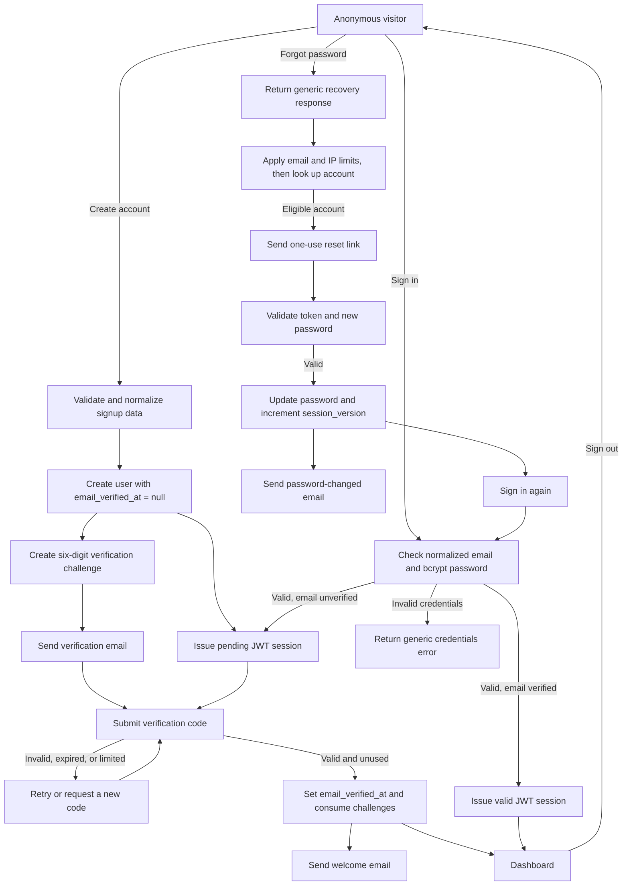
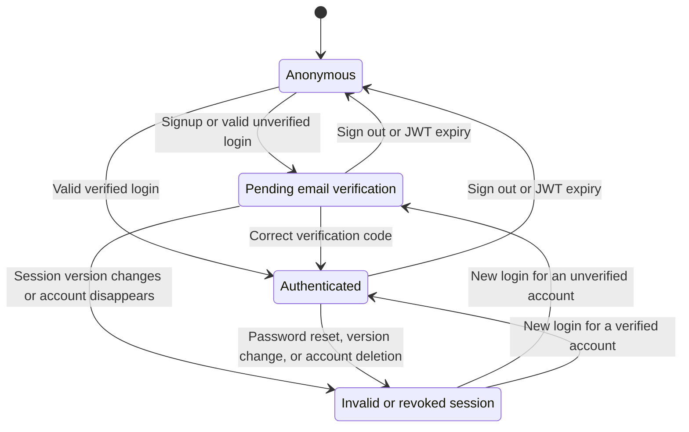

# Wooden Bridge authentication

This document describes the authentication system as implemented. It is the
reference for account creation, email verification, credentials login, session
authorization, password recovery, logout, and future feature gates.

## Flow overview



Email delivery is deliberately outside the authorization decision. A temporary
welcome or password-change notification failure does not undo a successful
verification or password update. A failed verification or reset email delivery,
however, invalidates the newly created challenge or token.

## Authentication states



The effective state is derived on every session evaluation by comparing the JWT
with current database state:

| State                | JWT user | `email_verified_at` | JWT version matches `session_version` | `sessionValid` | Effective access                   |
| -------------------- | -------- | ------------------- | ------------------------------------- | -------------- | ---------------------------------- |
| Anonymous            | No       | N/A                 | N/A                                   | `false`        | Public pages                       |
| Pending verification | Yes      | `null`              | Yes                                   | `false`        | `/verify-email` only               |
| Authenticated        | Yes      | Set                 | Yes                                   | `true`         | Public pages and `/dashboard/**`   |
| Invalid or revoked   | Yes      | Any                 | No, or user missing                   | `false`        | No protected routes; sign in again |

`email_verified_at` is the durable proof that the address was verified.
`session_version` is the revocation switch. `sessionValid` is the final access
decision and must be true before a feature treats a request as authenticated.

For future feature gating, keep account policy separate from identity proof. For
example, add an explicit `account_status` such as `active`, `suspended`, or
`closed`, then require all three conditions:

1. The session version is current.
2. The email is verified.
3. The account status permits the requested operation.

Do not infer suspension or product entitlement from `email_verified_at`.

## Route behavior

| Route                       | Anonymous | Pending verification          | Authenticated                   |
| --------------------------- | --------- | ----------------------------- | ------------------------------- |
| `/`                         | Allowed   | Redirected to `/verify-email` | Allowed with account navigation |
| `/sign-up`                  | Allowed   | Redirected to `/verify-email` | Redirected to `/dashboard`      |
| `/login`                    | Allowed   | Redirected to `/verify-email` | Redirected to `/dashboard`      |
| `/verify-email`             | Allowed   | Allowed                       | Redirected to `/dashboard`      |
| `/forgot-password`          | Allowed   | Redirected to `/verify-email` | Redirected to `/dashboard`      |
| `/reset-password?token=...` | Allowed   | Redirected to `/verify-email` | Allowed                         |
| `/dashboard/**`             | Denied    | Denied                        | Allowed                         |

The route proxy is a first boundary, not the only boundary. Any protected server
action, route handler, or data mutation should independently call `auth()` and
require a user, `emailVerified === true`, and `sessionValid === true` before
reading or changing private data.

## Security controls

| Control                | Current behavior                                                         |
| ---------------------- | ------------------------------------------------------------------------ |
| Password storage       | bcrypt with cost 12 for signup and password reset                        |
| Password policy        | 15-character minimum; 72-byte bcrypt maximum                             |
| Email handling         | Trimmed and normalized to lowercase before lookup                        |
| Session                | Auth.js signed JWT, 12-hour maximum age                                  |
| Session revocation     | Password reset increments `users.session_version`                        |
| Verification code      | Cryptographically random six-digit code, 10-minute expiry, one use       |
| Verification storage   | HMAC-SHA-256 digest keyed by `AUTH_SECRET`; plaintext code is not stored |
| Verification cookie    | HTTP-only, `SameSite=Lax`, secure in production, 10-minute lifetime      |
| Verification requests  | 3 per email per hour, 20 per IP per hour, 60-second resend cooldown      |
| Verification attempts  | 5 failed attempts per user and 20 per IP per 15 minutes                  |
| Reset token            | 32 random bytes encoded as base64url, 30-minute expiry, one use          |
| Reset storage          | SHA-256 token hash; plaintext token is not stored                        |
| Reset requests         | 3 per email and 20 per IP per hour                                       |
| Reset attempts         | 5 per token and 20 per IP per 15 minutes                                 |
| Enumeration resistance | Login, verification request, resend, and recovery use generic responses  |
| Email URLs             | HTTPS is required outside local development                              |
| Transactional email    | Resend in production; console delivery is rejected in production         |

Rate-limit email addresses and client IPs are HMAC-hashed with `AUTH_SECRET`
before storage. Database transactions and PostgreSQL advisory locks make limit
checks and one-time token consumption safe under concurrent requests.

## Stored authentication data

| Table                           | Purpose                                                   |
| ------------------------------- | --------------------------------------------------------- |
| `users`                         | Password hash, `email_verified_at`, and `session_version` |
| `email_verification_challenges` | Active and consumed verification challenges               |
| `email_verification_requests`   | Email and IP request-rate accounting                      |
| `email_verification_attempts`   | User and IP code-attempt accounting                       |
| `password_reset_tokens`         | Active and consumed reset-token hashes                    |
| `password_reset_requests`       | Email and IP recovery-request accounting                  |
| `password_reset_attempts`       | Token and IP reset-attempt accounting                     |

Old request, attempt, and expired challenge records are retained briefly for
rate limiting and deleted by opportunistic cleanup after authentication events.

## Configuration and migrations

Copy `.env.example` to a local ignored environment file and provide:

```dotenv
APP_URL=https://your-production-origin.example
AUTH_SECRET=<high-entropy-auth-secret>
DATABASE_URL=<postgres-connection-string>
RESEND_API_KEY=<resend-api-key>
RESEND_FROM_EMAIL=Wooden Bridge <account@your-verified-domain.example>
```

For local development only, `EMAIL_DELIVERY=console` writes verification codes
and reset links to the server terminal. It cannot be used in production.

Apply every authentication migration, in lexical order, to the target database:

```bash
npm run migrate:auth
```

Run migrations before deploying code that depends on new auth columns or tables.
Never commit a populated `.env` file, and rotate `AUTH_SECRET` only with the
understanding that existing signed sessions and HMAC-derived rate-limit data will
no longer validate as before.

## Manual verification checklist

Use a unique email address for each clean signup test.

- Create an account and confirm the browser lands on `/verify-email?sent=1`.
- Confirm protected and public routes redirect the pending session back to
  `/verify-email`.
- Enter an incorrect code and confirm the account remains unverified.
- Enter the emailed code and confirm the browser lands on
  `/dashboard?verified=success`.
- Sign out, sign in again, and confirm the dashboard is the landing page.
- Request a password reset and confirm the response does not reveal whether an
  account exists.
- Use the reset link once, then confirm reuse fails.
- Confirm the old password fails, the new password works, and sessions open in
  other browsers are rejected after the reset.
- Confirm verification, welcome, reset, and password-change messages appear in
  the email provider logs with the configured verified sender.
- Run `npm run lint`, `npm run prettier:check`, and `npm run build`.

## Code map

- [`auth.ts`](../../auth.ts) — credentials authorization and database-backed JWT
  validation.
- [`auth.config.ts`](../../auth.config.ts) and [`proxy.ts`](../../proxy.ts) —
  route authorization and redirects.
- [`app/lib/actions.ts`](../../app/lib/actions.ts) — login and signup actions.
- [`app/lib/actions/email-verification.ts`](../../app/lib/actions/email-verification.ts)
  — verification request, resend, submission, and restart actions.
- [`app/lib/auth/email-verification.ts`](../../app/lib/auth/email-verification.ts)
  — challenge creation, verification, limits, and consumption.
- [`app/lib/actions/password-reset.ts`](../../app/lib/actions/password-reset.ts)
  — recovery request and password replacement actions.
- [`app/lib/auth/reset-password.ts`](../../app/lib/auth/reset-password.ts) —
  reset-token creation, limits, and atomic consumption.
- [`app/lib/auth/recovery-email.ts`](../../app/lib/auth/recovery-email.ts) —
  transactional email delivery.
- [`migrations`](../../migrations) — authentication schema migrations.
