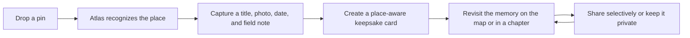

# Atlas product direction

Field Atlas is a private visual record of the places that shaped someone. The
map is the canvas, but the keepsake memory is the product. Every interaction
should move a person from a coordinate to a place they understand, a moment
they can feel, and a story they will want to revisit.

## Product promise

> Drop a pin. Keep the place. Return to the feeling.

Atlas should feel calm, personal, and quietly premium. It is not an itinerary
manager, a public social feed, or a scoreboard of countries visited. The core
loop is:

## Current foundation

The first Atlas release already provides the essential surface:

- a private, verified-user map with clustered pins;
- visited and ahead journey states;
- a memory drawer for title, place, date, field note, and photographs;
- search, filters, a memory tray, and the My Places collection;
- private Vercel Blob media storage with ownership checks, upload-intent
  reservations, and bounded per-account storage;
- optimistic pin placement with explicit, recoverable memory saves;
- structured city, region, and country context from reverse geocoding;
- photo-backed keepsake cards with collection thumbnails; and
- My Chapters with ordered routes and revocable, unlisted sharing.

The current product loop is fully implemented from pin placement through
keepsakes and chapters. The next leap is a stronger return loop, durable field
capture, and more intentional sharing controls without weakening the private
default.

## Priority roadmap

### Priority 1 — Place intelligence and capture quality

When a user drops a pin, Atlas should reverse-geocode it and store structured
context: a concise place name, locality, region, country, country code,
geocoder source, and resolution timestamp. The user can still replace the
display label with their own words.

The current implementation uses a configurable Nominatim-compatible endpoint
with a descriptive user agent. Reverse-geocoding sends the pin's coordinates
to that endpoint, so production deployments should select a provider whose
privacy terms fit Atlas or operate a compatible geocoder in the same trust
boundary. A provider outage must never prevent a user from saving a memory.

The capture drawer should show the recognized place immediately, distinguish a
visited date from a planned date, and make unfinished drafts visible. A memory
should not present raw coordinates or generic “Pinned place” copy when Atlas can
provide better context.

Location context is intentionally concise: show `City, State` when a state or
province is available, otherwise `City, Country`. A user's own place label
always takes precedence.

Success criteria:

- at least 95% of ordinary pin drops receive a usable place context;
- a user can understand where a pin is without reading latitude/longitude;
- geocoder failure never blocks saving a private memory;
- drafts are recoverable and clearly distinguished from finished memories.

### Priority 2 — Keepsake cards

Every saved memory should produce a designed card containing the title, place,
date, field note, journey state, and a cover image or place-aware illustration.
The first version should be deterministic and instant. AI can later suggest a
title, summary, or palette, but it must not invent facts about a location.

Cards should work in the collection, journal, map tooltip, and as a downloadable
or shareable artifact. A card is the clearest expression of the product's value.

### Priority 3 — My Chapters

Individual memories should be groupable into named chapters such as “Kyoto,
October 2026” or “Road trip through Michigan.” My Chapters gives each journey
an ordered reading experience, a mapped route, derived dates, cover imagery,
and a short introduction while leaving the original atlas memories intact. This
gives the map a narrative layer without turning Atlas into an itinerary planner.

The production chapter experience now includes:

- an accessible workshop for selecting up to fifty memories;
- explicit-button reordering that works consistently across pointer, touch, and
  keyboard use;
- a user-selected photographic cover with a sensible automatic fallback;
- optional authored prose between individual memories;
- an ordered, curved route and an editorial desktop/mobile reading experience;
- a cinematic public reader with native sharing, chapter-specific social
  previews, and a clear path into a new Field Atlas account;
- private-by-default chapters and unlisted read-only links;
- revocable sharing links that rotate when sharing is re-enabled;
- optional maps and approximate shared coordinates by default, with coordinates
  omitted entirely from public chapter data when a map is disabled;
- ownership-checked private originals, with public chapters restricted to
  metadata-stripped JPEG or WebP derivatives so EXIF data cannot bypass map
  privacy; bulk imports use JPEG for reliable canvas export on iOS browsers;
  and
- lazy thumbnails, bounded editor rendering, and off-screen content containment
  for responsive long chapters.

Chapter quality is measured as a complete path rather than a single screen:
creation, reordering, cover selection, reading, sharing, revocation, re-sharing,
and narrow-mobile use must all remain coherent. Original atlas memories stay
independent, private, and editable regardless of a chapter's sharing state.

### Priority 4 — The return loop

Atlas should reward returning:

- On this day memories;
- recent places and unfinished memories;
- nearby memories when the user is traveling;
- gentle resurfacing emails or notifications;
- seasonal or date-based memory collections.

The goal is to make Atlas a place people revisit, not a form they complete once.

### Priority 5 — Intentional sharing

Everything remains private by default. Users can selectively share one memory,
a chapter, or a collection through a read-only view or downloadable card.
Sharing should support approximate locations, hidden coordinates, expiring links,
and the ability to remove the map entirely.

### Priority 6 — Durable capture

Travel often happens with unreliable connectivity. A later phase should support
offline drafts, queued photo uploads, background sync, clear saved-locally
states, and retryable failures.

## Data direction

The current coordinate-plus-freeform-label model should grow into a structured
place context while preserving the user's own label:

| Layer            | Examples                                         |
| ---------------- | ------------------------------------------------ |
| Position         | latitude, longitude                              |
| Recognized place | name, locality, region, country, country code    |
| Memory           | title, note, visited/planned date, journey state |
| Presentation     | cover media, card variant, palette               |
| Story            | chapter, order, route metadata                   |
| Privacy          | private, approximate-share, shared               |

Structured data makes search, cards, chapters, accessibility, and future
recommendations more reliable.

## Product principles

1. **Every pin should feel like a finished artifact.** Avoid generic fallback
   copy when useful context is available.
2. **Capture must be effortless in the field.** One hand, few decisions, clear
   progress, and graceful offline behavior.
3. **The map should reveal meaning, not just density.** Use camera movement,
   chapters, routes, and place context intentionally.
4. **Privacy is part of the experience.** Exact coordinates and photographs are
   personal by default.
5. **AI should assist memory, never fabricate it.** User approval remains the
   final authority for generated text or visual treatment.
6. **Calm beats clutter.** Preserve whitespace, restrained motion, and a small
   number of meaningful controls.

## Measures of desirability

- pin-to-finished-memory completion rate;
- time from pin placement to first saved memory;
- percentage of memories with place context, photo, and field note;
- seven- and thirty-day revisit rate;
- card opens, exports, and shares;
- percentage of drafts recovered and completed;
- map interaction latency and media upload success rate.
