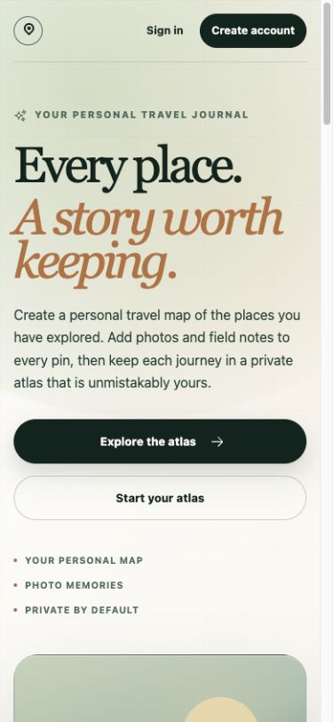
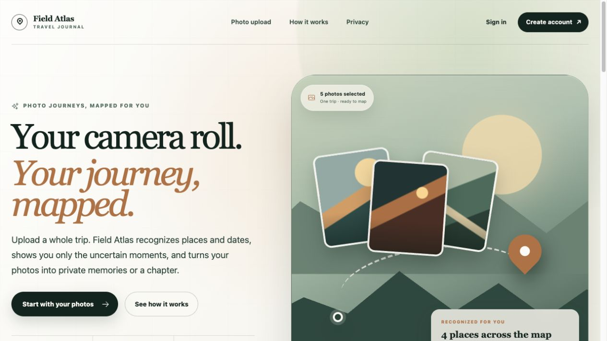
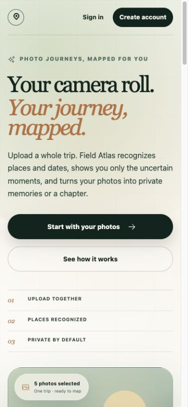
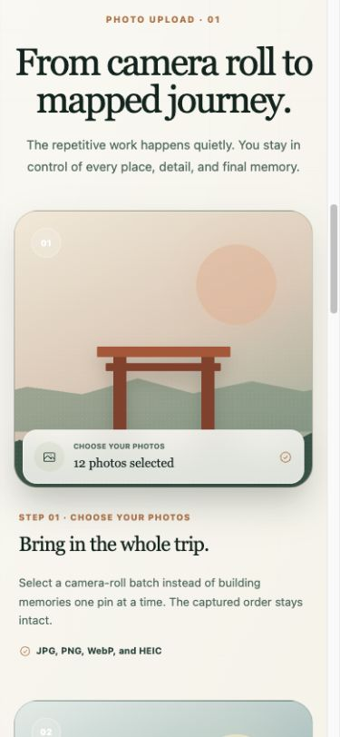
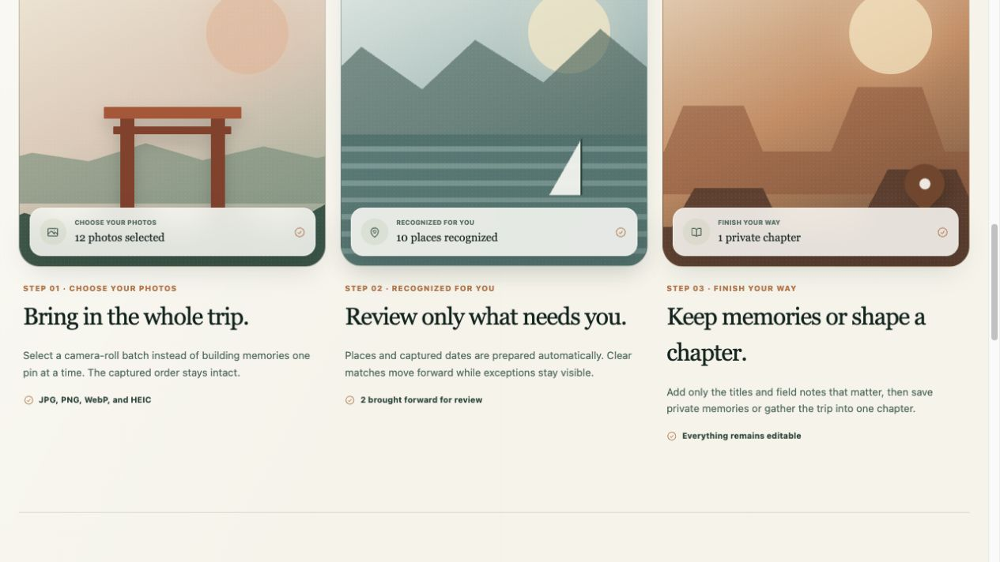
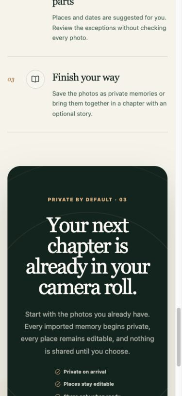

# Landing page UI/UX refresh

Reviewed in the running application at 320, 390, 519, 520, 521, 899, 900,
901, and 1280 px widths.

## What changed

The previous page was visually polished but described a broad, manual travel
journal. Photo upload appeared only inside supporting copy, while the primary
action scrolled to an inspiration gallery.

The refreshed page now follows the product's primary journey:

1. Upload a camera-roll batch.
2. Let Field Atlas recognize places and captured dates.
3. Review only uncertain or unusable items.
4. Save private memories or shape the trip into a chapter.

The hero now makes photo upload the primary action, returning members go
directly to `/dashboard/import`, and guests enter through account creation. The
hero illustration shows uploaded photos becoming recognized map locations. The
former destination gallery now explains the upload workflow with concrete
states, and the closing callout reinforces privacy, editability, and deliberate
sharing.

Navigation, metadata, and page keywords now use the same product language.

## Responsive findings

- No horizontal overflow or header collisions were found from 320 to 1280 px.
- Primary actions remain 52 px tall.
- Feature-status overlays remain contained inside their artwork at every tested
  width.
- The 520/521 px typography boundary now resolves to 58.4 px on both sides.
- The tablet illustration is capped before the 900/901 px layout transition,
  avoiding an abrupt scale jump.

## Screenshots

### Previous mobile opening

### Refreshed desktop opening

### Refreshed mobile opening

### Photo-upload story

### Privacy close

## Efficiency and polish pass

The follow-up pass removes repetition and makes the upload path both shorter and
more concrete:

- Mobile no longer repeats the same benefit in the hero and feature sections.
- The three feature cards now preview selection, recognition review, and chapter
  output instead of using decorative destination artwork.
- A dedicated 901–1100 px layout tier prevents the former tablet breakpoint
  cliff, while feature cards use an auto-fitting grid.
- Guest calls to action preserve a finite `photo-import` intent through account
  creation, verification, and login, then land at `/dashboard/import`.
- Small labels meet readable contrast, interactive targets are at least 44 px,
  and non-interactive cards no longer imply click behavior.
- The landing route no longer loads MapLibre's 70 KB stylesheet, runs a global
  pointer-tracking loop, or pulls password hashing into its server dependency
  graph.

## Browser-size verification pass

The final rendered page was checked from 320–2560 px, including the exact
360/361, 520/521, 641/642, 720/721, 900/901, 947/948, and 1100/1101 px layout
seams. Common portrait, landscape, short-height, laptop, desktop, and ultrawide
viewports were also exercised.

That pass corrected three last details: the odd feature card is now centered
for the full two-column range, the tablet footer uses an intentional second
row instead of wrapping link labels, and all primary header/footer targets are
at least 44 px. The final sweep found no horizontal overflow, header or hero
collisions, escaped callout content, undersized primary targets, or off-center
odd cards.
