# Image upload UI/UX review

Reviewed in the running application with representative Detroit, Kyoto, and
Colorado camera-roll fixtures at desktop, 390 px mobile, and 320 px narrow
mobile widths.

## Outcome

The upload-first flow now reads as the primary way into Field Atlas. Selection,
privacy, review, and optional-detail decisions remain visible without exposing
backend terminology. Desktop hierarchy is strong, and the mobile flow preserves
the same decisions without horizontal overflow.

Two issues were found and corrected during the visual review:

1. The selection summary counted only unreadable files, so a missing-place photo
   could visibly need action without being included in “need attention.” The
   count now includes missing-place, duplicate, and unreadable states.
2. The mobile optional-details action tray stacked its forward actions and was
   124 px tall, covering the form heading. At phone widths it now keeps the
   actions in one compact row; it is about 83 px tall at 390 px and still has no
   horizontal overflow at 320 px.

A follow-up mobile-spacing pass standardized the route around a 16 px layout
rhythm and 16 px card padding, tightened the header and form spacing, shortened
only the visible phone footer labels while preserving their full accessible
names, and reduced the optional-details dock to 70 px. The actual dashboard
shell now verifies at 20 px outer gutters on both tested phone widths.

## Second-pass findings

A second rendered pass covered upload, review, optional details, chapter setup,
completion, location editing, and leave confirmation at 320 px, 390 px, and
500 px. It found and corrected four additional mobile edge cases:

1. Chapter creation exposed three stacked footer actions, producing a 175–187
   px sticky dock. Compact visible labels now preserve the full accessible names
   while keeping all three actions in a 70–71 px row.
2. Long review states such as “Remove 2 unreadable photos” could expand the
   review dock to 83 px. The phone/tablet label is now concise without changing
   the control's accessible name.
3. Import dialogs trapped keyboard focus but allowed the page behind them to
   scroll. Both the document and body now stay locked until the dialog closes.
4. The leave-dialog button stack inherited end alignment, preventing its
   intended full-width controls. The stack now stretches across the bottom
   sheet. Mobile chapter covers also use a landscape ratio so the section title
   and privacy state remain visible above the sticky dock.

## Third-pass findings

The breakpoint-boundary pass exposed abrupt spacing and media jumps at 480/481
px and 760/761 px, plus sticky action trays intersecting review controls, story
fields, and chapter content. These are now resolved:

1. Mobile card padding, radius, gaps, map height, story-photo height, and header
   scale interpolate fluidly instead of switching between unrelated fixed
   values.
2. Compact action trays now participate in document flow through 1120 px. They
   remain adjacent to the decision they complete without covering buttons,
   inputs, headings, maps, or cover choices.
3. On optional details, the action row appears directly after the form and
   before the journey outline, preserving the forward path without requiring a
   scroll past the full outline.
4. The 479/480/481 and 759/760/761 px boundary matrix reports zero element
   intersections and zero horizontal overflow. Card padding progresses from 16
   px at 480/481 to 22.8/22.83 px at 760/761 rather than jumping. Story media
   progresses from 288/289 px to 456/457 px across the same boundaries.

## Screenshots

### Desktop selection

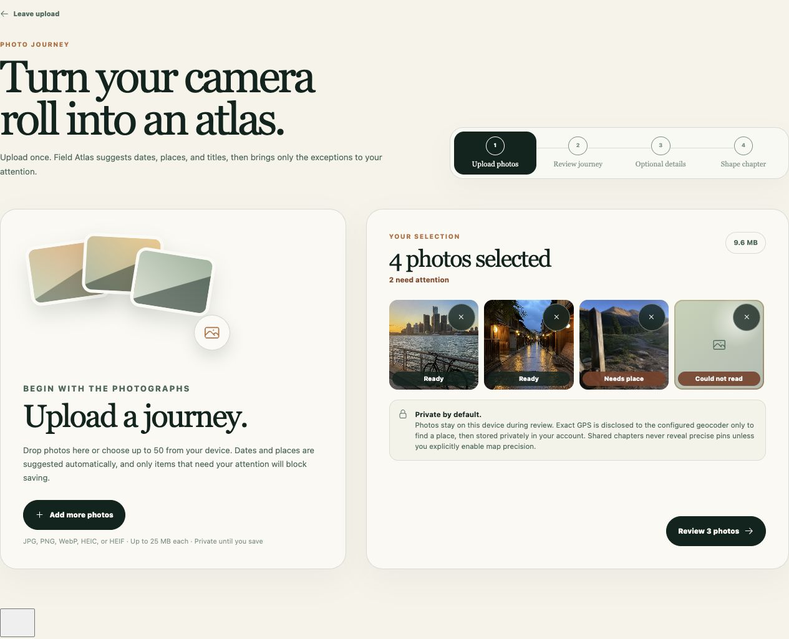

### Desktop exception-only review

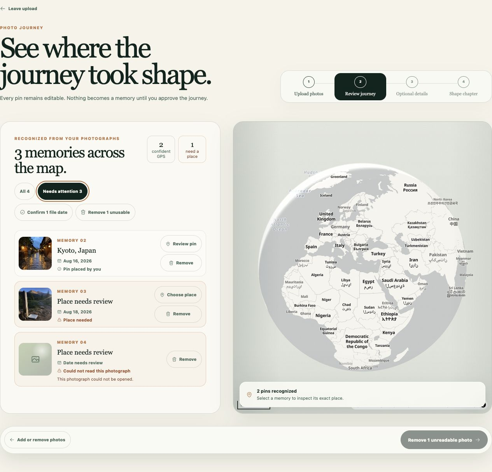

### Desktop optional details

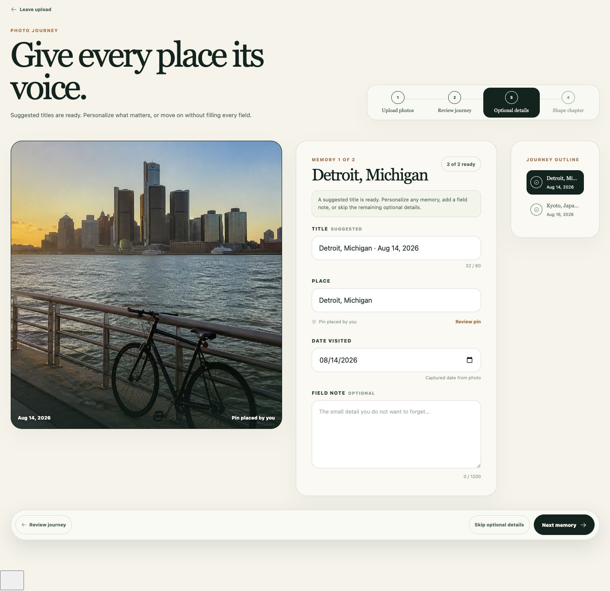

### Mobile selection

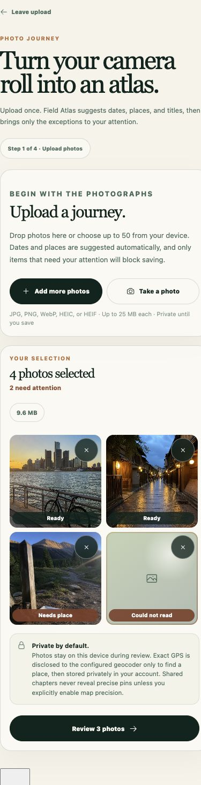

### Mobile review

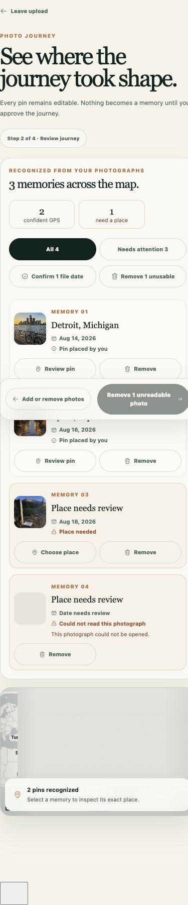

### Mobile optional details

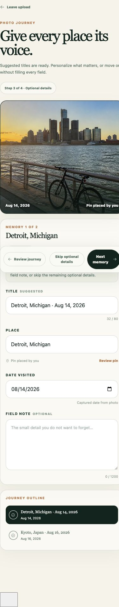

### Final mobile spacing pass

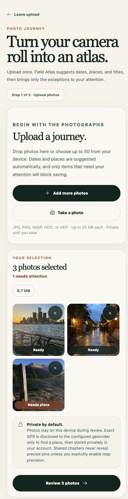

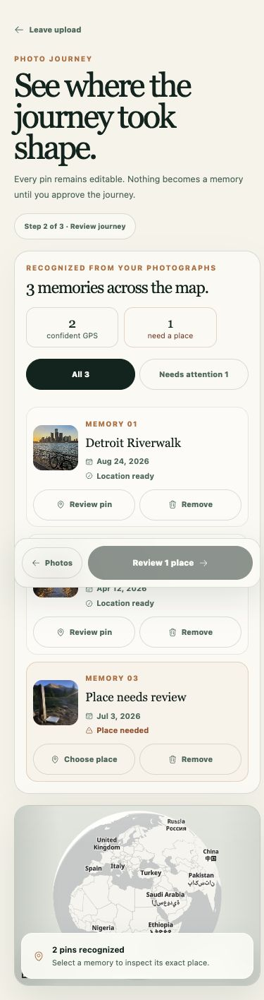

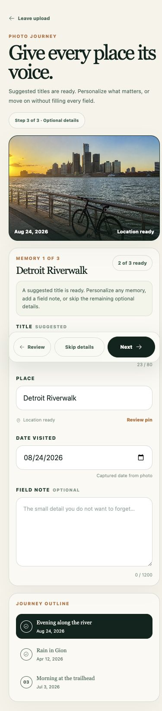

### Second mobile pass

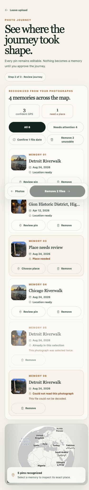

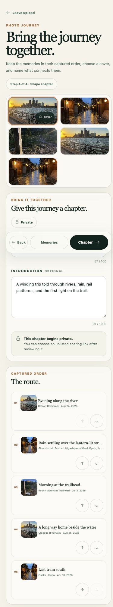

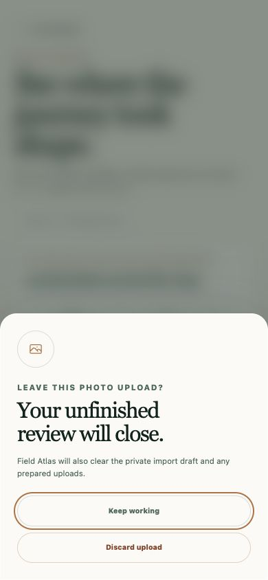

### Third mobile pass

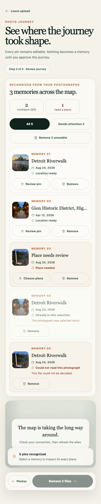

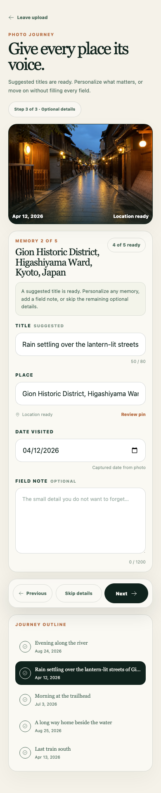

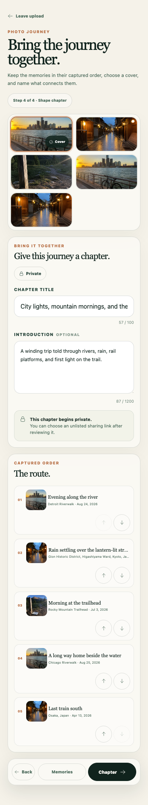

## Interaction checks

- Drag/drop, file input, mobile camera input, and all-selection visibility are
  covered by UI tests.
- Removing a sample thumbnail immediately updated “4 photos selected” to “3
  photos selected” and “2 need attention” to “1 needs attention.”
- “Needs attention” reduced the review list from four photographs to the three
  exceptions.
- Bulk confirmation and removal reduced the exception list from three items to
  the single missing-place photograph.
- The 390 px and 320 px layouts had no horizontal overflow.
- At 320 px, both sticky action docks remain 70 px tall and all source controls
  retain at least a 44 px target height.
- Review, story, and chapter docks remain 70–71 px tall through the complete
  760 px mobile breakpoint instead of regressing between phone and tablet.
- At 320 px, 375 px, and 390 px, page gutters remain 20 px, compact actions are
  44–48 px tall, and no action tray overlaps adjacent content.
- Browser diagnostics reported no application warnings or errors.

## Test fixtures

- [Detroit riverwalk](test-images/riverwalk-test.png)
- [Kyoto after rain](test-images/kyoto-test.png)
- [Colorado trailhead](test-images/trailhead-test.png)

These are generated, non-user fixtures used only for visual QA. They contain no
embedded location metadata, so the harness deliberately supplied representative
ready, low-confidence-date, missing-place, and unreadable states.
